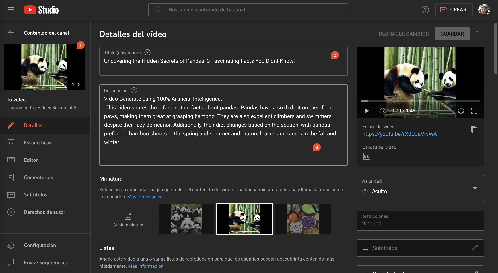
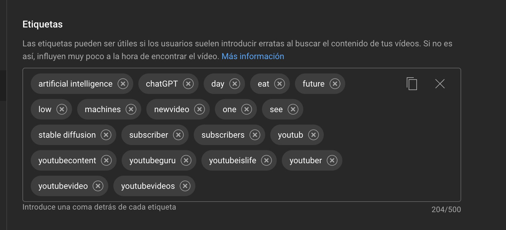
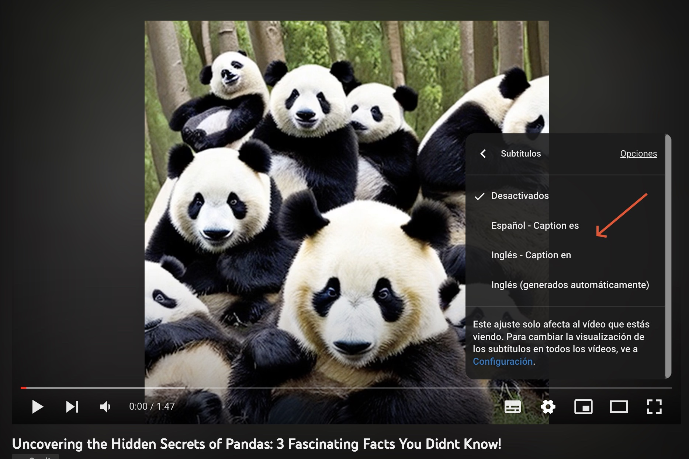

# AI Cinema Engine

This project uses AI-powered text generation engines to generate video scripts, which are then used to create videos with frames, captions, and voiceovers. The project is written in Python and utilizes a variety of third-party services and APIs.


## Project Requirements

- `python` 3.x (this project was developed using `python` 3.9.6)
- `virtualenv` installed (or any virtual environment manager ex: `conda`) 
- `pip` installed
- `git` installed

## Local Installation

### Clone the Project
```bash
git clone https://github.com/Zentra94/ai-cinema-engine.git
```

### Create virtual environment:
```bash
virtualenv venv
```
### Activate the virtual environment:
```bash
venv/Scripts/activate
```
### Packages installation with pip:
```bash
pip install -r requirements.txt
```
### (Optional) Create all directories:
```bash
python configs.py
```

## 3th. Party Credentials

### Add environments variables

Please follow the instructions on each respective link to obtain the corresponding API 
keys for the services (all of them are free but have usage limits):

- [OpenAI](https://help.openai.com/en/articles/4936850-where-do-i-find-my-secret-api-key) (chatGPT)
- [Replicate](https://replicate.com/docs/get-started/python) (stable-diffusion) 
- [Picovoice](https://github.com/Picovoice/picovoice/tree/master/sdk/python) (captions)

Add the API at the `.env.example` file as follows, and rename as `.env` as follows:
```text
# .env
OPENAI_API_KEY=<OPENAI_API_KEY>
STABLEDIFFUSION_API_KEY=<STABLEDIFFUSION_API_KEY>
PICOVOICE_API_KEY=<PICOVOICE_API_KEY>
```
Please follow the instructions on each respective link to obtain the JSON-formatted 
keys and save them to their respective locations:

- [Google Cloud Platform Service Account](https://cloud.google.com/iam/docs/service-accounts-create) (Speech-to-Text) &rarr;  `keys/client_secrets.json`
- [Client Secrets](https://developers.google.com/youtube/v3/quickstart/python) (Youtube Data API v3) &rarr;  `keys/GCP_sa_key.json`


## Usage

You can have a E2E execution (create & upload a new video) running the `python main.py "TITLE PROMPT"` as the next example:

```bash
python main.py "create a unique title of a youtube video of 3 curios facts about pandas bears"
```

Wait some minutes, and you will have a result like this (click the image for check the video):

[](https://www.youtube.com/watch?v=LP7kzXZt34Q)

This will include: cover page image for the Youtube miniature (1), automatic title (2) and description (3).



Also, will upload some ad-hoc tags.



And will provide some multi-language subtitles (uploaded automatically as well).



For more details and configurations you can check `packages/video_manges/core/screenwriter.py` & `packages/video_manges/core/youtube.py` files.


## (Optional) Add Virtualenv at Jupyter Notebook's Kernel

```bash
python -m ipykernel install --name venv --display-name "Ai-cinema-engine-venv"
```

## Contributors

- Franco Zentilli Traverso (@Zentra94)

## Backlog

- [ ] :fire::fire: Add social media trend scrapper to automatize title prompt creation.
- [ ] :fire::fire: Add AI [music engine](https://google-research.github.io/seanet/musiclm/examples/) to background music videos.
- [ ] :fire: Improve prompt engineering (get verb, subject, etc..) to get better images.
- [ ] :fire: Improve [cover](https://blog.devgenius.io/how-to-generate-youtube-thumbnails-easily-with-python-5d0a1f441f20) creation, that will attract more viewers to the video.
- [ ] :+1: Improve content: check that chatGPT is not using "narrator" structure output or defaults answers _"as a natural language model I'm not..."_ and replace respectively.
- [ ] :+1: Fix stable-diffusion NSFW detector.
- [x] :eyes: Fix bug `upload_thumbnails` apply default image instead of input one.
- [ ] :eyes: Improve the serialization of `json` responses (current as "PLACE_HOLDER").
- [ ] :eyes: More docstring and unitary test.
- [ ] :eyes: Fix unitary test of `test_youtube`. Configure a better `conftest.py` and avoid local dependencies.
- [x] :eyes: Test E2E execution via `main.py`.

