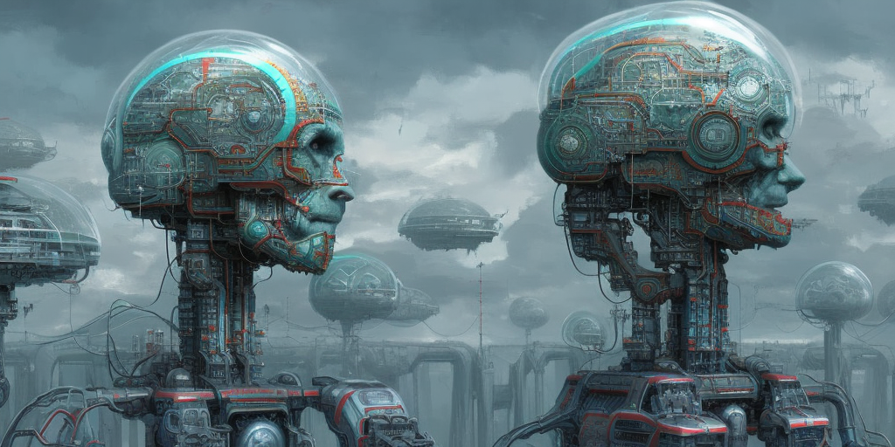

# AI Cinema Engine



## Project requirements

- `python` 3.x (the project was developed using python 3.9)
- `virtualenv` installed (associated with you py3 installation)
- `pip` installed (associated with you py3 installation)
- `git` installed

## Local installation

### Clone the project
```bash
git clone https://github.com/Zentra94/ai-cinema-engine.git
```

### Create virtual environment:
```bash
virtualenv venv
```
### Activate the virtual environment:
```bash
venv/Scripts/activate
```
### Packages installation with pip:
```bash
pip install -r requirements.txt
```
### For create all directories:
```bash
python configs.py
```

### Add environments variables
```text
# .env
OPENAI_API_KEY=<OPENAI_API_KEY>
STABLEDIFFUSION_API_KEY=<STABLEDIFFUSION_API_KEY>
PICOVOICE_API_KEY=<PICOVOICE_API_KEY>
```
### Add keys
#### Client secrets (Youtube)
 `keys/client_secrets.json`

#### Service Account key (Google Cloud Platform)
 `keys/GCP_sa_key.json`

## (Optional) Add Virtualenv at Jupyter Notebook's Kernel  

```bash
python -m ipykernel install --name venv --display-name "Ai-cinema-engine-venv"
```
